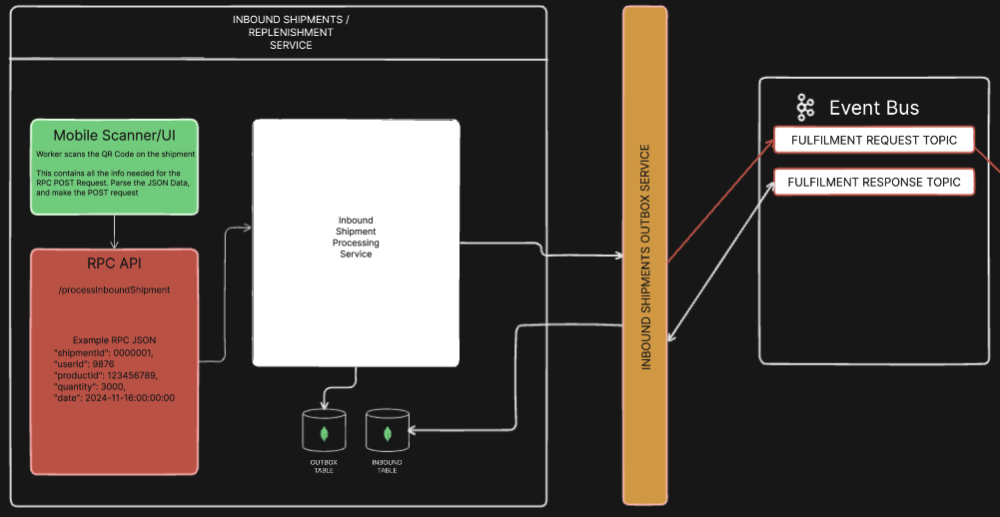

# Warehouse Architecture.

### Exploring how a large warehouse (eg Amazon) processes its products

The purpose of this project is to create an advanced event-driven architecture in Rust. Utilising the Transactional Outbox Pattern using the following technologies:

- Rust
- Apache Kafka
- MongoDB
- React

The project will consist of many services, running independently from each other, to create a fully decoupled system.

### Inbound Service

